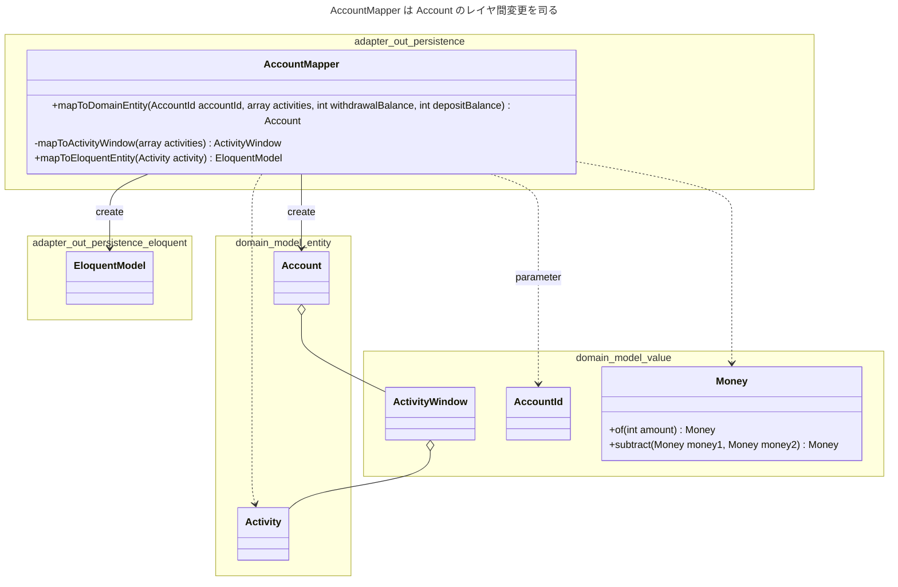

```mermaid
---
title: AccountMapper は Account のレイヤ間変更を司る
---
classDiagram
  namespace adapter_out_persistence {
    class AccountMapper {
      +mapToDomainEntity(AccountId accountId, array activities, int withdrawalBalance, int depositBalance) Account
      -mapToActivityWindow(array activities) ActivityWindow
      +mapToEloquentEntity(Activity activity) EloquentModel
    }
  }

  namespace adapter_out_persistence_eloquent {
    class EloquentModel
  }

  namespace domain_model_entity {
    class Account
    class Activity
  }
  
  namespace domain_model_value {
    class ActivityWindow
    class AccountId
    class Money {
      +of(int amount) Money
      +subtract(Money money1, Money money2) Money
    }
  }
  
  AccountMapper --> Account : create
  AccountMapper ..> Activity
  AccountMapper ..> AccountId : parameter
  AccountMapper ..> Money
  AccountMapper --> EloquentModel : create
  Account o-- ActivityWindow 
  ActivityWindow o-- Activity
```
