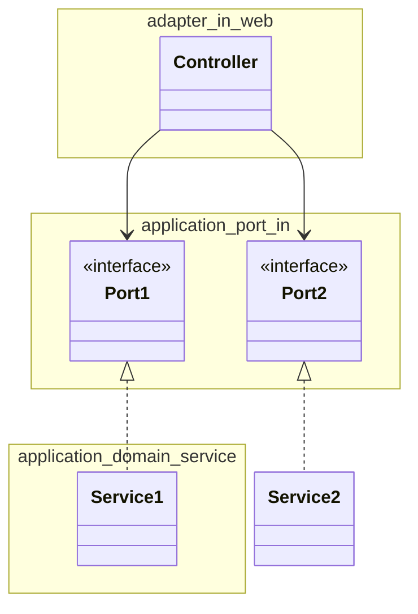

写経: 手を動かしてわかるクリーンアーキテクチャ
====

# 5章:
## 5.7: 濃いドメインモデル vs 薄いドメインモデル
- 濃いドメインモデル
  - ドメインロジックはアプリケーションの核にあるドメインモデルに可能な限り実装される
  - そのドメインモデルに自身の状態を変えるメソッドを提供させることで、ビジネスルールに従った状態の変更しかできないようにし、常に状態が妥当であることを維持できるようにする
  - この例では Account クラス(domain entity)
  - Usecaseはどうなるか
    - ドメインモデルへの入り口として振る舞う
    - ユーザが何を行おうとしているのかという意図を表現するものでしかない
    - 責務はその意図を一連のドメインオブジェクトへの呼び出しに変換するだけ
      - 実際の処理はドメインオブジェクトで行われることになる
    - 「送金する」というユースケースは、送金元と送金先の口座の情報をDBから取得し、  
      その取得した情報からエンティティを作成し、  
      作成したエンティティに対して withdraw や deposit メソッドを呼び出したあと、  
      状態が変わったドメインモデルをDBに保存する。
- 薄いドメインモデル
  - エンティティは単なる入れ物になり、アクセサだけを持つ（ドメイン貧血）
  - ビジネスルールの妥当性確認を行ったり、Entity状態を変えたり、  
    状態を変えたドメインモデルを送信ポートに送り保存させる責務をUsecaseが担う。
  - ビジネスルールはドメインオブジェクトとではなく、Usecaseに実装される。

## 5.8: ユースケースごとに異なる出力モデル
- 可能な限りユースケース独自のものにするべき
- 本当に必要なデータしか含まれなくなるから
- 異なるユースケース間で出力モデルを共有すると密結合になってしまう
- 単一責任の原則(SRP)に従う

# 6章: Webアダプタの実装
## 6.1: 依存関係の逆転
- 受信アダプタ(Webアダプタ・コントローラ) から アプリケーション層にある受信ポートを系宇してサービスへと向かう

- ポートは外部からアプリケーション核とコミュニケーションをとるための仕様を提示している
  - ポートがあることでテスト用ドライバも作りやすくなる

## 6.2: 受信アダプタの責務
- REST API の場合
  - HTTPリクエストを受け取り、プログラムで利用可能なオブジェクトに変換する
  - 認証/認可
  - 入力値の妥当性確認
  - 入力値をUsecaseの入力モデルに変換
  - Usecaseの呼び出し
  - Usecaseの出力モデルをHTTPレスポンスに変換
  - HTTPレスポンスを返す
