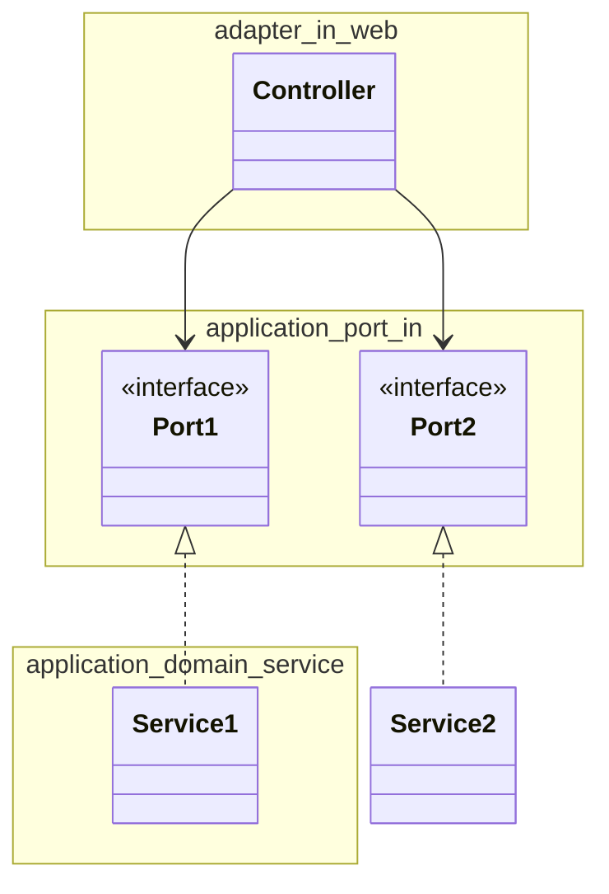
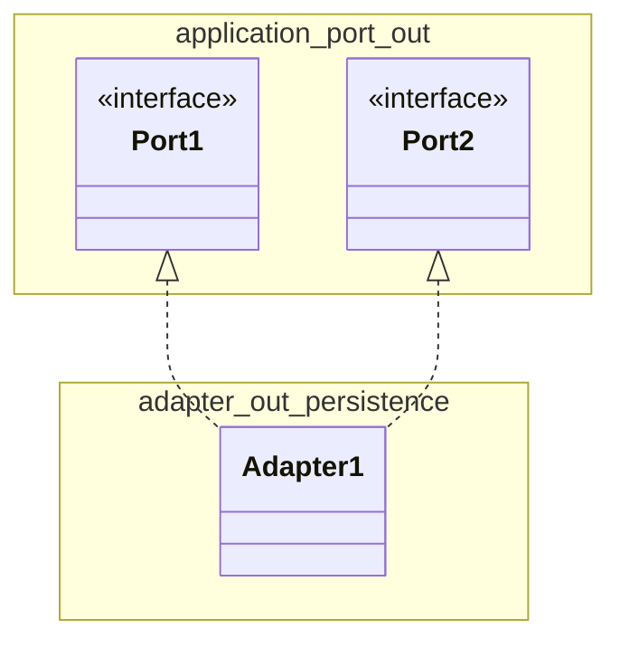
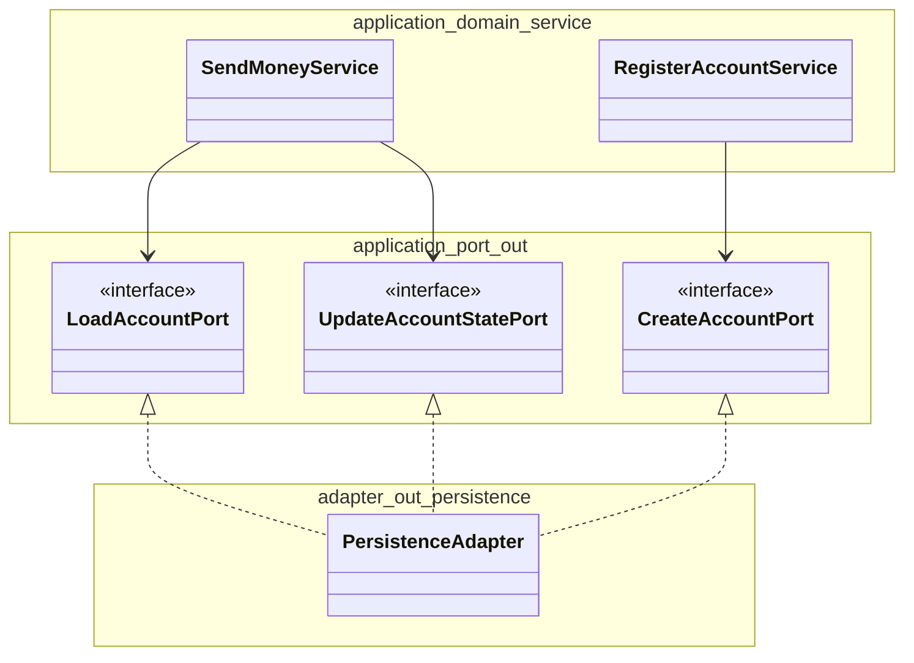
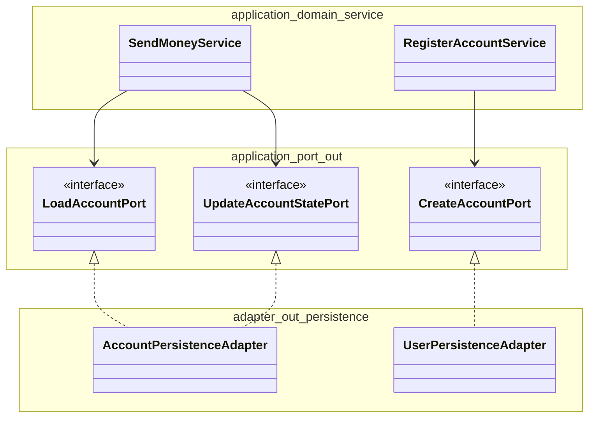
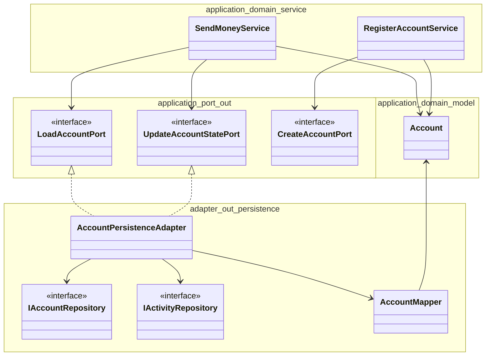

写経: 手を動かしてわかるクリーンアーキテクチャ
====

# 5章:
## 5.7: 濃いドメインモデル vs 薄いドメインモデル
- 濃いドメインモデル
  - ドメインロジックはアプリケーションの核にあるドメインモデルに可能な限り実装される
  - そのドメインモデルに自身の状態を変えるメソッドを提供させることで、ビジネスルールに従った状態の変更しかできないようにし、常に状態が妥当であることを維持できるようにする
  - この例では Account クラス(domain entity)
  - Usecaseはどうなるか
    - ドメインモデルへの入り口として振る舞う
    - ユーザが何を行おうとしているのかという意図を表現するものでしかない
    - 責務はその意図を一連のドメインオブジェクトへの呼び出しに変換するだけ
      - 実際の処理はドメインオブジェクトで行われることになる
    - 「送金する」というユースケースは、送金元と送金先の口座の情報をDBから取得し、  
      その取得した情報からエンティティを作成し、  
      作成したエンティティに対して withdraw や deposit メソッドを呼び出したあと、  
      状態が変わったドメインモデルをDBに保存する。
- 薄いドメインモデル
  - エンティティは単なる入れ物になり、アクセサだけを持つ（ドメイン貧血）
  - ビジネスルールの妥当性確認を行ったり、Entity状態を変えたり、  
    状態を変えたドメインモデルを送信ポートに送り保存させる責務をUsecaseが担う。
  - ビジネスルールはドメインオブジェクトとではなく、Usecaseに実装される。

## 5.8: ユースケースごとに異なる出力モデル
- 可能な限りユースケース独自のものにするべき
- 本当に必要なデータしか含まれなくなるから
- 異なるユースケース間で出力モデルを共有すると密結合になってしまう
- 単一責任の原則(SRP)に従う

# 6章: Webアダプタの実装
## 6.1: 依存関係の逆転
- 受信アダプタ(Webアダプタ・コントローラ) から アプリケーション層にある受信ポートを系宇してサービスへと向かう

- ポートは外部からアプリケーション核とコミュニケーションをとるための仕様を提示している
  - ポートがあることでテスト用ドライバも作りやすくなる

## 6.2: 受信アダプタの責務
- REST API の場合
  - HTTPリクエストを受け取り、プログラムで利用可能なオブジェクトに変換する
  - 認証/認可
  - 入力値の妥当性確認
  - 入力値をUsecaseの入力モデルに変換
  - Usecaseの呼び出し
  - Usecaseの出力モデルをHTTPレスポンスに変換
  - HTTPレスポンスを返す

## 6.3: コントローラの分割

- 1コントローラに詰め込もうとすると
  - みづらい、テストしづらい、理解しづらい
- 操作ごと、ユースケースごとに分解することがおすすめ

# 7章: 永続化アダプタの実装
- DB中心になっちゃだめよ
- この依存の向きを逆にして、アプリケーション層に永続化アダプタを差し込む方法

## 7.1: 依存関係の逆転

- 送信アダプタがあるから、永続化の関心事をドメインから隔離できる

## 7.2: 永続化アダプタの責務
- 入力モデルを受け取る
  - ドメイン層のエンティティでもいいし、DB処理のための情報を持った専用のクラスでもいい
    - ただし何を使うのかをインタフェイスに定義して示す必要がある
  - 入力モデルはアプリケーションの核に属するものであり、永続化アダプタには属さない
    - 永続化に関するコードが原因で入力モデルに対して変更が加えられることはない
- DB操作を行えるものに変換する
- 変換されたものを使ってDBを操作する
- DBから返ってきたものをアプリケーションが扱える出力モデルに変換する
- 変換された出力モデルを返す
  - 出力モデルはアプリケーションの核が所有するものであり、永続化アダプタには属さない 

型変換が面倒なときにどうするかは8章

## 7.3: 送信ポートの分割

- テーブル単位にすると、送信ポートが肥大化してしまう
  - そのサービスが使わないメソッドに対しても依存してしまう
  - テスト時に、どのメソッドをモックすればいいのかわからず混乱、完全に実装されたモックかどうかわからず混乱、などが発生する
  - 原則としては、クライアント（ここではサービス）が必要とするメソッドだけを提供するインターフェイスを定義するべき
    - インターフェイス分離の原則
    - LoadAccountPort, UpdateAccountStatePort, CreateAccountPort

## 7.4: 永続化アダプタの分割

- 永続化アダプタは、最終的にすべての送信ポートが実装されるのであれば複数用意しても問題ない
  - AccountPersistenceAdapter, UserPersistenceAdapter
- ORMを使うか生SQLを使うかはアダプタ側の自由
- 集約ごとに永続化アダプタを1つ用意すると、bounded contextを分離することになった場合に、そのための基盤がすでに出来上がっていることになる
  - AccountPersistenceAdapter, BillingPersistenceAdapter
- bounded contextが他のコンテキストからの情報を必要とする場合は、ドメインサービスを呼び出すか、2つのコンテキストが連携して処理を行うように調整するアプリケーションサービスを導入するようにする（詳しくは13章）

## 7.5: Spring Data JPAを用いたサンプル

- 面倒でも型変換しろと言っている

## 7.6: DBトランザクション

- 永続化アダプタの呼び出しを調整するサービスに移譲するべき
- framework特有のアノテーションがアプリケーションの核に入り込むが、現実を見て妥協しろと言っている

## 7.7: まとめ

- ポートを基点に置き換え可能な永続化アダプタを作成すれば、アプリケーションの核を永続化に関する関心事から解放できるようになる
- それが、深いドメインモデルを構築することにつながる
